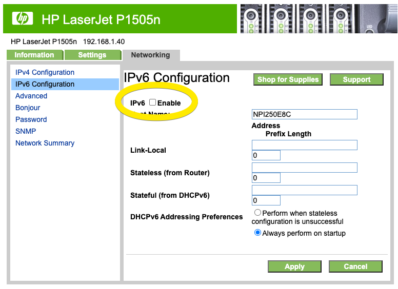

My venerable
[HP1505N](https://support.hp.com/us-en/drivers/selfservice/hp-laserjet-p1500-printer-series/3435666/model/3435670)
stopped working recently, would not even start, appeared to have
died. It turned out to be related to a home network upgrade and was
easily resolved.

Upon turning on, it would begin making the usual noises, status lights
would flash as usual, then it would unexpectly simply turn itself
off. Sometimes it would get as far as printing out a partial self test
/ configuration page before shutting down (if I pressed the "GO"
button before it died).  It appeared like it was the end of the road
for the old printer. I initially thought the power supply was failing,
until I discovered that if I unplugged it from the network then it
started fine, and would print a self test / configuration page. If I
connected via USB, and left it off the network, then it would print
fine. Interestingly, if I connected to a standalone computer via
ethernet it would work fine, but when I put it back on my home
network, it would die. I watched the network activity with Wireshark
and it showed that the printer woke up, sent a few network discovery
packets, then there was a flourish of IPV6 activity on the network,
and then the printer went silent. IPV6 traffic on my home network was
new. Could it be that the old printer was crashing as a result of the
new IPV6 activity? It turned out, yes, and the fix for me was to
simply disable IPV6 on the printer.

Here's how:

1. Connect it to a stand alone computer using ethernet, and turn it on.

2. If it was formerly using DHCP then it will time out (because there
is no DHCP server on your stand alone printer-computer network). That
will take about 30 seconds or so. Then hold the "GO" button to print a
status page. You should see that it has defaulted to a network address
of 169.254.241.75.
* Unless, the printer has a static IP address configured then it will
show that address.
* If for some reason, you need to perform a [factor
  reset](https://h30434.www3.hp.com/t5/Printers-Archive-Read-Only/HP-LaserJet-P1505n/td-p/2690),
  here is how:

`
1. Turn off the printer
2. Hold the "GO" and "Cancel" buttons at the same time.
3. Press and release the power button while still holding the "Go" and "Cancel" buttons.
4. Release the "Go" and "Cancel" buttons after about 6 seconds after you press the power button.
`

3. Configure you computer to use an IP address on the same subnet as
the printer's IP address, e.g. 169.254.241.99, and connect to the
printer's web interface at http://169.254.241.75. Adjust those
addresses as necessary if the printer has a static IP address
configured.

4. Disable IPV6:

5. Reboot the printer, and it should startup fine... if IPV6 was the
indeed the problem.

